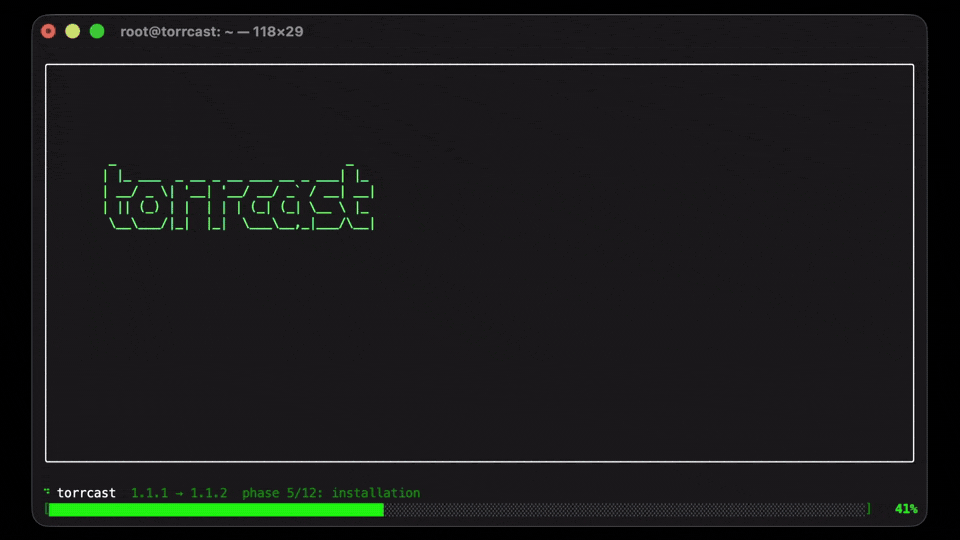

[日本語](docs/README-jp.md) | [Español](docs/README-es.md) | [Русский](docs/README-ru.md) 

# torrcast

**Name a film - and it is already playing on the TV.**

One command in the terminal finds a film, a series or an anime by its name and puts it on
the TV. No cloud in the data path, no media library, no download queue, no picking through
torrents and audio tracks by hand. The stream goes straight through: from the swarm to
your server, from there to the TV. There are no third parties between you and the picture.

<p align="center">
  
</p>

## What it looks like

```console
$ cast matrix --menu
searching “matrix”... 2.4 s
  1. The Matrix (1999) · IMDb 8.7 · 2 h 16 min
     The Matrix is a 1999 science fiction action film written and directed by the
     Wachowskis.
  2. The Matrix Reloaded (2003) · IMDb 7.2 · 2 h 18 min
     ...
  3. The Matrix Revolutions (2003) · IMDb 6.7 · 2 h 9 min
     ...
Enter - “The Matrix (1999)”, item 1 of 3
What are we watching? [1]:
looking for an English voice: release 1 of 47 - tracks... 2.3 s
packing... 3.1 s
waiting for the TV... 1.2 s
playing “The Matrix” (1999) · 1080p · eng · Original - on TV   (start 9 s)
```

Without `--menu` there is no question at all: torrcast takes the liveliest picture and
names it out loud in a single line. `start 9 s` is the time to the first live frame on the
screen, not to the moment the receiver reported itself ready. From there the remote is in
charge again: pause and seek work as with any other source. The run is abridged, because
release numbers, seeders and timings move with the answers of the indexers and the swarm.

## Why it is convenient

- **One command.** You ask, and it plays. No release to pick, no download queue, no audio
  track housekeeping. Often without a single question.
- **Series run themselves.** The next episode starts without a question and without
  reconnecting to the TV. A season ends and torrcast looks for the next one on its own and
  goes on from its first episode. The series ends and it says so honestly.
- **The voice picks itself.** By the language of the product: an English install puts
  English tracks first, a Russian one puts Russian tracks first.
  `cast <query> --voice STUDIO` remembers the favourite voice of that picture for good.
- **The internet may drop, the film will not.** While you watch, the film warms up onto
  the disk in the background, whole. After the warm-up you finish it with no network at
  all, seeking included.
- **Nothing extra on the disk.** The cache lives exactly as long as the viewing does. No
  media library, no "should clean that up some day".
- **Smoothness over numbers.** The release is a little heavy for the receiver, so the
  heavy chunks get recoded on the fly. Quality is sacrificed last, and only as much as it
  takes to keep the picture from buffering.
- **It speaks English and Russian.** `cast --en` and `cast --ru` switch the whole product:
  labels, messages, the bot's replies and the voice it looks for.
- **A Telegram bot.** `cast -tg`, and the TV can be driven from a chat.
- **Honest.** Not one silent substitution. Every automatic decision gets its own plain
  line:

```text
release 1 actually 574p - taking 2 (actually 1080p)
attention: ~36 Mbit/s - heavy chunks get recoded on the fly
video hevc - recoding it whole on the fly
```

## What torrcast is not

- **Not a torrent downloader.** On the disk there is only what is playing, and only while
  it plays.
- **Not a media server.** No library, no web face, no accounts. There is a command.
- **Not a cloud service.** No third-party server in the path of the stream: the address
  for the TV is worked out from the route to it, and DNS takes no part in the playback
  path.

## Installation

```sh
curl -fsSL https://torrcast.anysda.space | sh
```

This is the English build of the product; the Russian one is installed by
`https://rutorrcast.anysda.space`. The choice is not final either way: `cast --en` and
`cast --ru` switch an installed copy at any moment. The one-liner asks GitHub for the
latest version, pulls the tarball of exactly that version, verifies its SHA-256 checksum
and is idempotent: a second run updates only what changed. Neither registration nor
external API keys are needed.

Requirements: Linux with systemd (Debian 12 or newer, or Ubuntu; the install goes to
`apt`), Python 3.11 or newer, root for the install, about 33 GB of free disk for the
warm-up, and a TV or a set-top box with a built-in **Chromecast** receiver on the same
network. The measurements were taken on a machine with 8 GiB of memory; a smaller one
simply gets a smaller cache.

From source:

```sh
git clone https://github.com/anysda/torrcast && cd torrcast
sudo ./install.sh
```

The flag names the language by hand: `-en` installs the English copy, `-ru` the Russian
one. Without a flag a clean install writes English.

The install finds the receiver on its own, over mDNS and by walking the local subnets.
If there are several, `cast --tv` shows the list and `cast --tv <ip>` writes the address
down directly.

## Commands

```text
cast <query> [sNeM]     # find it and put it on; sNeM is season and episode: cast "doctor who" s2e5
cast                    # what is playing now (same as cast status)
cast stop               # drop the cast and save the position
cast status             # position, file, track, torrent, share warmed up
cast doctor             # checks the terminal, ffmpeg, the services, the receiver and the torrent
cast log [--since 2d]   # the session journal: every rebuffer and every drop
cast voices <query>     # the audio tracks of the release that will go to the TV
cast releases <query>   # the table of releases, by picture
cast -tg                # Telegram bot setup
cast --tv               # find the receivers on the network
cast -h                 # help on every flag
```

Useful flags: `--menu` (ask which picture), `--pick N`, `--release N`,
`--voice [N|STUDIO]`, `--new` (the same release from the start), `--dry` (the whole
reasoning with no cast). Anything left unfinished continues silently: the same torrent,
the same file, the same track, the saved position. The playing line says so and names the
way out of it.

## Under the hood

```text
query -> search (Prowlarr) -> parsing (release names, franchises, sNeM)
      -> stream (TorrServer) -> ffmpeg -> HLS -> cast (Chromecast)
                             \-> warm-up (the whole film onto disk, in the background)
```

There is no permanent playback daemon: for every showing `cast` raises a transient systemd
unit with ffmpeg, an HLS server and a position watcher. The command may exit, the showing
goes on. The warm-up reads ahead at four times real time under `nice` and freezes
completely when the live showing needs the processor: the spot being watched right now
always comes first.

The receivers are measured and described by profiles (Samsung Q70D, an Android TV box on a
Xiaomi TV Stick); an unknown receiver gets the careful profile. HEVC on a receiver without
a decoder for it is recoded whole, 2160p plays through a downscale to 1080p, and this is
always said out loud.

The code is held to hard rules: a layered architecture (domain / ports / usecases /
adapters / cli / runtime), more test lines than code lines, a linter, strict mypy and
structural gates that must pass before any release.

## Licence and responsibility

The torrcast code is distributed under the [MIT](LICENSE) licence. The licence covers the
code only and grants no rights to whatever you watch with it: the sources and their
legality are the user's responsibility.
